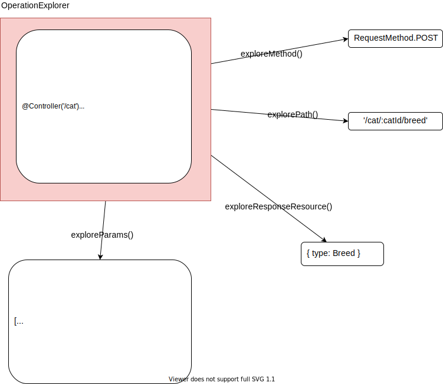
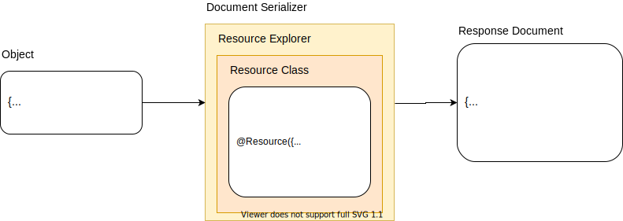
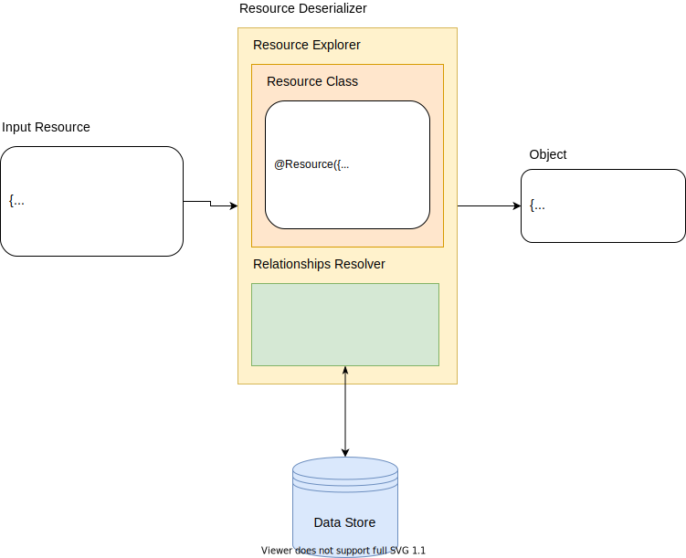
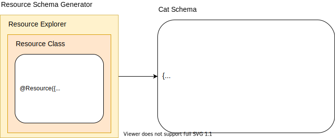

## Термины

__Фрагмент API__ - любая часть REST API приложения. Например: контроллер, параметр запроса, тело запроса,
endpoint.

## Структура

- `metadata.ts` - константы ключей меты
- `decorator` - декораторы, устанавливающие мета-данные
- `deserializer` - преобразует ресурсы в объекты
- `explorer` - собирает и нормализует мета-данные о фрагментах API
- `nest` - подклбчает плагин во фреймворк
- `openapi` - набор классов, представляющих типы OpenAPI. Используются для построения спецификации
- `scanner` - собирает по приложению мета-данные для построения специйикации OpenAPI
- `schema-generator` - преобразует класс ресурса в json-schema для запросов и ответов
- `serializer` - преобразует объекты в ресурсы

## Использование мета-данных

__Explorer__\`ы - это внутренниие классы плагина. Обычно, они не применяются на уровне приложения.
## Сериализация
Для сериализации ресурсов и коллекций вводится специальный тип сущности - __Serializer__.

## Десериализация

При десериализации может быть использован умный RelationshipsResolver,
который автоматически получит указаные в запросе отношения ресурса из храниилща.
## Построение JSONSchema

Плагин умеет основываясь на классе ресурса строить JSONSchema для запросов и ответов.

## Построение спецификации OpenAPI
Плагин умеет извлекать из прилолжения все endpoint`ы и, основываясь на их мета-данных, строить
спецификацию REST API. Учитываются параметры запроса, классы принимаемых и возвращаемых ресурсов.
